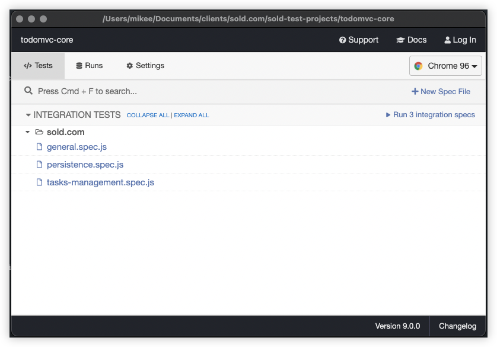

<h1 align="left">
    
</h1>

# Automated Testing Project

## Overview

As a QA/Jr Developer Candidate, one of your first tasks will be to immerse yourself in the various sold.com projects by reading and creating automated tests. Internally, we use [Cypress](https://www.cypress.io/) for all automation and component testing, so that is where we get started with all candidates.

## Requirements

Using the starter package included with these instructions, install the necessary depedencies

```sh
npm install cypress --save-dev
```

### Add Cypress Automation Testing

Add the [Cypress Automation Environment](https://www.cypress.io/) to new test project, remove the sample **integration** tests, then add a new folder labeled `sold.com` in **integration** folder.

The project uses the `baseURL` defined in `cypress.json`

```json
{
  "baseUrl": "http://todomvc.com/examples/react/"
}
```

Create npm `test` script to execute `cypress open`

```json
  ...
  "scripts": {
    "test": "cypress open"
  },
```

When you are ready to execute tests, call `npm run test` from console, which will open the cypress test running application

```sh
npm run test
```

<h1 align="left">
    
</h1>

### Test Cases

Once you have the project setup locally, you will create a series of test cases against the TodoMVC application. Feel free to organize this tests as you wish, we will be looking for code style and test organization, thus do what you feel most comfortable with.

- There will be 2 test specifications
  - `./cypress/integration/sold.com/general.spec.js`
  - `./cypress/integration/sold.com/tasks-management.spec.js`
- Each test specification will have one `describe` section will contain 7 tests
- There will be a total of 14 tests (not including bonus section)

#### `general.spec.js` specification

In the specification, you should have:

- `beforeEach` block which calls `cy.visit('/')`
- 7 test blocks (one for each of the Test items outlined)

> **Test 1**

- [ ] Initial page display, assert the main and footer sections should be hidden

> **Test 2**

- [ ] When page is initially opened, it should focus on the todo input field

> **Test 3**

- [ ] Add todo, should clear text input field when an item is added, assert field is blank

> **Test 4**

- [ ] Add todo, assert the main and footer sections should not be hidden

> **Test 5**

- [ ] Add new todo item and assert that it exists

> **Test 6**

- [ ] Add three todos and make sure they all exist, and assert there are 3 li items

> **Test 7**

- [ ] Add todo item which has leading and trailing spaces, when created should trim

#### `task-management.spec.js` specification

In the specification, you should have:

- `beforeEach` block which calls `cy.visit('/')`
- 7 test blocks (one for each of the Test items outlined)

> **Test 1**

- [ ] Using setup method, then mark all as completed. After marked complete, assert all items have "completed" class

> **Test 2**

- [ ] Using setup method, then mark all as completed. After marked complete, toggle completed flag and assert the "completed" class has been removed

> **Test 3**

- [ ] Using setup method, then assert the ".todo-count" has text "2 items left"

> **Test 4**

- [ ] Using setup method, mark one of the todos as completed, then assert "Clear Completed" is available

> **Test 5**

- [ ] Using setup method, mark one of the todos as completed, click Clear Completed button, assert that marked item no longer exists

> **Test 6**

- [ ] Using setup method, should hide other controls when editing

> **Test 7**

- [ ] Using setup method, should highlight the currently applied filter (hint use `.within` method)

### Visual Tests (for validation purposes)

_Verify that the Cypress Run contains_

- 2 describe blocks, with each block containing 7 tests
- 7 tests in each block
- there are a total of 14 tests
- there are no errors

### Bonus

The following section is bonus tests, but is not required for the overall project.

> **Bonus Test 1**

- [ ] Verify todos are persisted

1. Create new test suite `./cypress/integration/sold.com/persistence.spec.js`
2. Create test to verify persistence
   - create method (e.g. `testState`) to verify todos exist
   - create one or more todos
   - then validate test state
   - reload page (using `.reload()` method)
   - then validate test state again to assure todos are persisted

> **Bonus Test 2**

- [ ] Add new npm script which runs test in command line only (not using `cypress:open`)

_Note: Make sure there are no errors (you can view the videos which are created to review any possible errors)_

### Publish Completed Project to GitHub

Upon completion, publish finished project to GitHub and supply project link to <merickson@sold.com> or <mtrieu@sold.com>

## Resources

The following is summary of resources referenced in Automated Testing Project

- [Cypress.io](https://www.cypress.io/)
- [TodoMVC React w/ TypeScript](https://todomvc.com/examples/typescript-react/#/)
